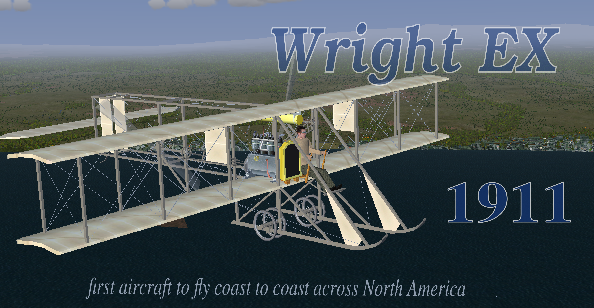

# Wright EX (1911)

This is a representation of the 1911 Wright EX for FlightGear.

## Current State

This plane has had a long journey to FlightGear. I originally made the model for the Windows based simulator, Micro Flight. Many years ago I began to port it over to FlightGear but didn't progress too far.

More recently I picked up the project again and quickly discovered that all of my FlightGear knowledge was deprecated due to the passage of time. Consequently, I set out to re-learn the ins-and-outs of FGFS by modifying an existing early plane (Emmanuel Barranger's Bleriot, IIRC). I mostly focused on the basics of getting the plane into the simulator, how to animate it, how to create liveries and the basics of YASim FDMs.

As always with my projects this is a work in progress. Since there is very little performance data on these early planes, the FDM is mostly conjecture and relies heavily on the FDM of a dissimilar plane of the same vintage. Nor have I completed the textures and UV mapping of the model.

To install the *Vin Fiz* simply unzip the files into your FGFS aircraft directory. Rename the uncompressed folder by removing the '-main' from the folder name. E.g., the folder should be named 'WrightEX-1911' not 'WrightEX-1911-main'.

## History

The Wright EX was a smaller version of the Wright Model B aeroplane. It was specifically designed for exhibition flying before the Wright brothers withdrew from sponsoring such flights. (They eventually decided that exhibition flying was inherently risky and would eventually give the new science of aviation a bad reputation as pilots continued to put their lives at risk in increasingly dangerous maneuvers in order to thrill their audiences.)

In 1911, Cal Rodgers was the first pilot to fly across the United States. He flew a Wright EX and was followed by a team in an automobile and a custom train set up as a mobile workshop. It's a good thing he had a support team with him since virtually all of the plane's parts had to be replaced during the 84 day trip. Rodgers' flight was sponsored by the Armour Meat-Packing Company and his plane became a flying advertisement for 'Vin Fiz'--a grape flavored soft drink. Sadly, Rodgers was killed during an exhibition flight just weeks after his successful transcontinental flight.

The *Vin Fiz* (or at least some of it) is on display at the National Air and Space museum in Washington, D.C.

